# PWNME 2023 Write-up
### by **Prince2Lu**
---

## Nanobits
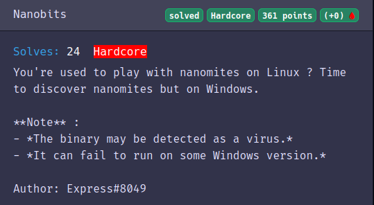

Premièrement le fichier donné est au format PE, il faudra donc un environnement Windows pour espérer le lancer.


On utilise Ghidra pour découvrir le binaire, le début est très difficilement compréhensible et on a du mal à se repérer.


Il n'y a aucune chaine de caractère définie en statique dans le programme, le titre nous avait prévenu, on est sur une protection par nanomites


Usuellement on trouve les nanomites sur des binaires ELF avec des traces comme le syscall PTRACE, qui permet de gérer de manière extérieure le sous-programme


on pourrait penser au premier abord que la fonction `SetUnhandledExceptionFilter` en `0x00401238` fait partie de la protection, mais il faut chercher plus loin.


---

Le programme est compilé avec une technique ASLR (Address space layout randomization)

Je vais avoir besoin de poser beaucoup de breakpoint, heureusement pour nous il existe le programme [setdllcharacteristics](https://blog.didierstevens.com/2010/10/17/setdllcharacteristics/) sur windows qui supprime le flag DYNAMIC_BASE du header du binaire, avec ça on pourra poser des breakpoints directement à partir de l'adresse récupérée en static depuis Ghidra.

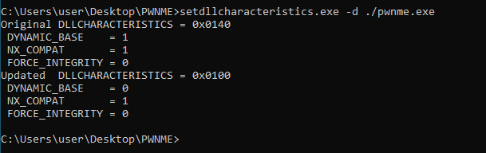

---

On se base sur les différentes actions du programme pour retrouver du code / une fonction:

- La création d'un nouveau processus enfant, qu'on regarde avec ProcessHacker 
- L'affichage du message "Enter flag :"


Je pose des breakpoints successifs avec gdb dans le programme à des endroits stratégiques de comparaison comme ``0x00401bba``, ici dans la fonction ``004016e4`` le sous-programme démarre
On peut le confirmer avec l'utilisation de la fonction [CreateProcessW](https://learn.microsoft.com/en-us/windows/win32/api/processthreadsapi/nf-processthreadsapi-createprocessw), il n'est pas possible de le voir statiquement mais un œil avisé sait reconnaître du [API HASHING](https://www.ired.team/offensive-security/defense-evasion/windows-api-hashing-in-malware)

Pour retrouver les fonctions utilisées j'utilise [x32dbg](https://x64dbg.com/)

On copie l'adresse ou le call se produit, ici:

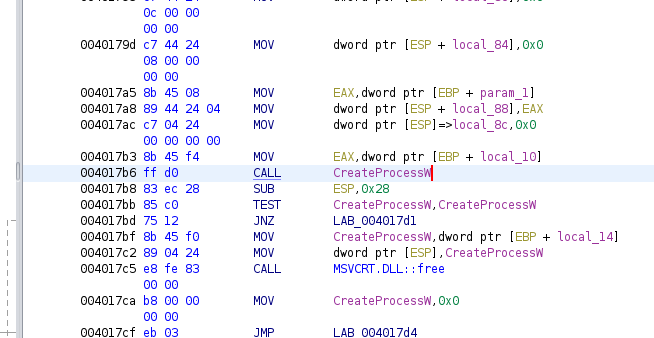


on pose un breakpoint sur x32dbg à la même adresse du call (ici ``0x004017b6``)


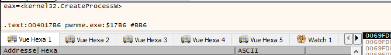


Une fois sur le breakpoint, x32dbg fait le travaill de trouver le nom dans la export table de kernel32.dll ou se trouve CreateProcess, j'utiliserai cette technique pour le tout le reste du challenge

La fonction ``004028e2`` est celle qui nous interesse

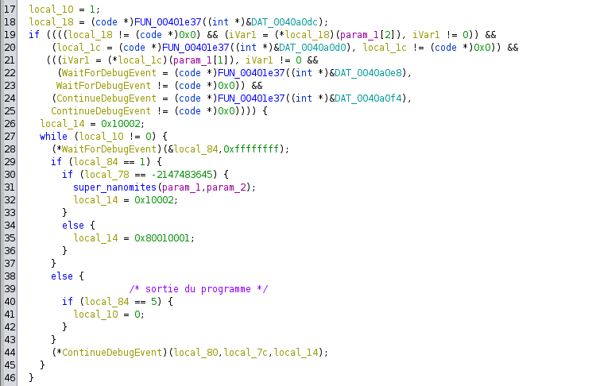

On y retrouve avec la technique de tout à l'heure des fonctions de la debugapi comme ``WaitForDebugEvent`` et ``ContinueDebugEvent`` (sur l'image les variables contenant l'adresse des fonctions sont rename par mes soins)

Donc, en gros, le programme attend à l'infini un événement du tracee (qui sera un int3), à la réception, il appelle la fonction ``0040240`` que j'ai appelé ``super_nanomites`` parce que ce challenge à été fait par Express et que tout ce que touche Express est super.


Sur cette grande branche de if on peut se sentir perdu, en fait local_14 n'est pas vraiment un array au sens littéral
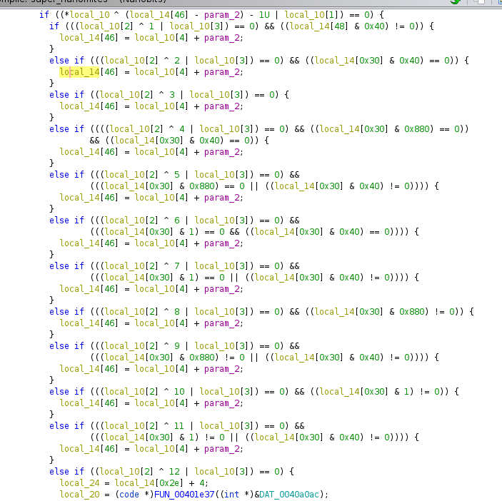

Il faut s'appuyer de la fonction (toujours obfuquée) ``SetThreadContext`` en ``004028bd``

Si on s'interesse au [2eme argument de la fonction](https://learn.microsoft.com/en-us/windows/win32/api/processthreadsapi/nf-processthreadsapi-setthreadcontext) on retrouve notre local_14 qui doit être de type [CONTEXT](https://learn.microsoft.com/en-us/windows/win32/api/winnt/ns-winnt-context)

On modifie le type de local_14 en CONTEXT et on a quelque chose de beaucoup plus logique

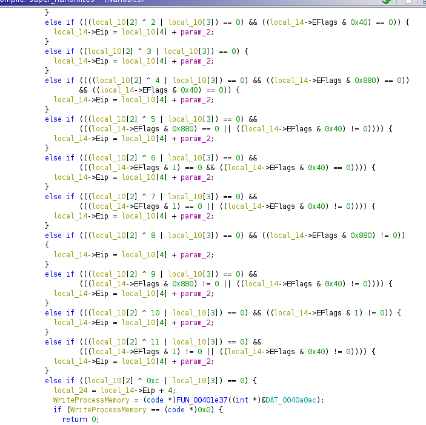 

On ne va pas s'attarder sur toutes les conditions, le ctf s'arrête dans 1H30

SetThreadContext va modifier les registres du tracee pour le contrôler. Mon idée est de break sur la fonction SetThreadContext dans le programme et récupérer le 2eme argument, notamment EIP qui est un pointeur vers l'instruction éxécutée par le programme

Suffit de mettre un breakpoint sur la fonction, récupérer le 2eme argument qui est la structure CONTEXT, récupérer l'EIP dans CONTEXT, puis on aurait une bonne idée de ce que fait et ou va le programme à chaque interruption.

Je met mon breakpoint sur ``004028b3``, puis on ouvre gdb

```
(gdb) b *0x004028b3
Breakpoint 1 at 0x4028b3
(gdb) command 1
Type commands for breakpoint(s) 1, one per line.
End with a line saying just "end".
>set $targetEIP = $edx+0xb8
>set $targetESP = $edx+0xc4
>print "targetEIP:"
>x/xw $targetEIP
>print "targetESP:"
>x/xw $targetESP
>c
>end
(gdb) r
```
On peut récupérer ces offsets sur WinDBG avec la commande ``dt _CONTEXT``


J'ai la flemme donc je le prends sur ghidra directement

Ce qui va m'intéresser ça ne va pas être ce qui va être affiché avant la lecture de stdin mais le comportement du programme après.

On rentre un début de flag qui pourrait valider les 1eres conditions, honnêtement ça marche avec n'importe quoi

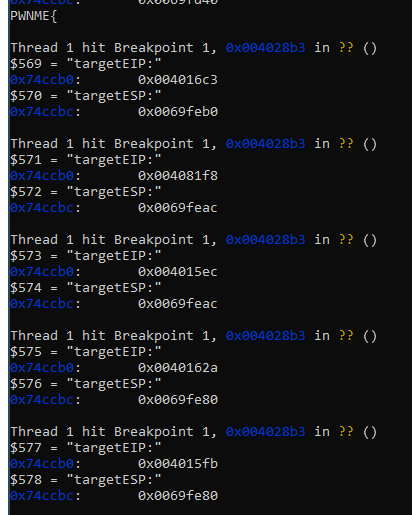 

Ce qui nous manque c'est le programme debuggé, je lance une instance du programme (sans debug), le programme s'ouvre avec son processus enfant, avec ProcessHacker j'utilise la fonctions *clique droit sur le programme enfant*  > Miscellaneous > Detach from debugger 

Puis je l'ouvre avec x32dbg avec l'option attach,

Je pose un breakpoint sur la 1ere adresse donnée par gdb (``0x005016c3``)

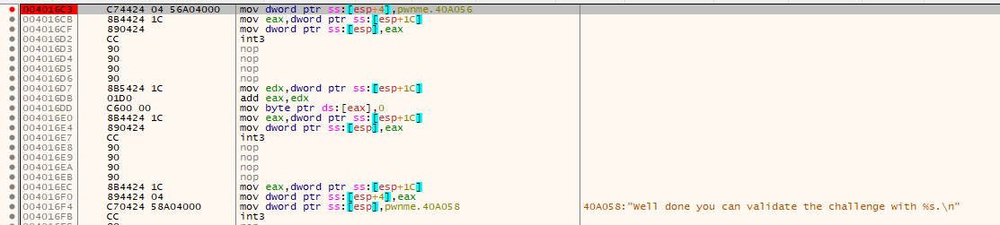

Je rentre un faux flag (de préférence le même qu'on a mis sur gdb ) sur le programme attaché à gdb, puis l'exécution s'arrète à notre breakpoint

Maintenant en utilisant l'option "set EIP here" de x32dbg, à chaque fois que EIP arrive à int3, je le met à la prochaine adresse de EIP donnée par gdb, on passe par la fonction strcspn, mais rapidement j'arrive à ``004015FB`` au bout du 5e coup

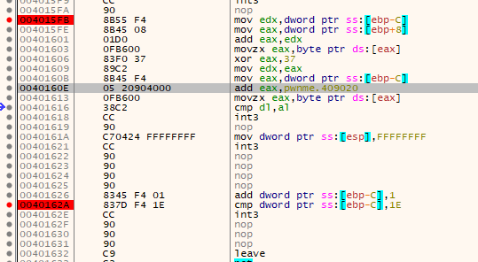

ici une chaine est xor caractère par caractère avec la valeur 0x37 puis est comparé à notre entrée, étrange

Je clique droit puis *follow in dump* sur ``pwnme.409020``

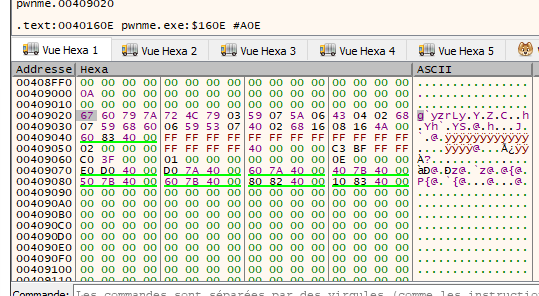

On séléctionne les valeurs de 0x67 à 0x4A qui constitue le tableau

[La suite vous la conaissez](https://gchq.github.io/CyberChef/#recipe=From_Hex('Auto')XOR(%7B'option':'Hex','string':'37'%7D,'Standard',false)&input=NjcgNjAgNzkgN0EgNzIgNEMgNzkgMDMgNTkgMDcgNUEgMDYgNDMgMDQgMDIgNjggMDcgNTkgNjggNjAgMDYgNTkgNTMgMDcgNDAgMDIgNjggMTYgMDggMTYgNEEgCg)


Merci à Express#8049 pour ce challenge 