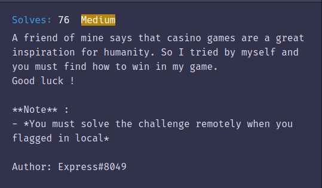

# PWNME 2023 Write-up
### by **Prince2Lu**
---
## Rottor


```bash
$ ./rottor 1> ./result.txt
```
```py
def rotate_right(string, amount):
    amount = amount % len(string)
    rotated_string = string[-amount:] + string[:-amount]
    return rotated_string
def rotate_left(string, amount):
	amount = amount % len(string)
	rotated_string = string[amount:] + string[:amount]
	return rotated_string


def find_nearest_null_index(data, index):
    nearest_distance = len(data)
    nearest_index = None

    for i in range(len(data)):
        if data[i] == 0x00:
            distance = abs(index - i)
            if distance < nearest_distance:
                nearest_distance = distance
                nearest_index = i

    return nearest_index


file = open("result.txt", "rb")
data = file.read()


target = 32

for _ in range(32):
    indice = find_nearest_null_index(data, target)
    element = target-indice

    if(element<0):
        print("L",end="")
        if(len(str(element).replace("-","")) == 1):
            print("0", end="")
        print(str(element).replace("-",""),end="")
        data = rotate_left(data, abs(element))
        target = target+64-abs(element)
    else:
        print("R",end="")
        if(len(str(element).replace("-","")) == 1):
            print("0", end="")
        print(element,end="")
        data = rotate_right(data, abs(element))
        target = target+64+abs(element)


file.close()


print("")

```

***Note:***

Si on a pas de chance et que ``element`` > 99 il faut relancer, ça arrive une fois sur 3 environ